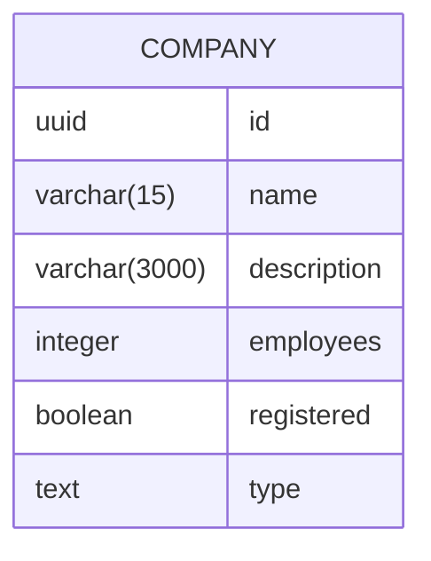

# Company Service

This is a simple service that provides a REST API for managing companies.

## Introduction

The service is written in Go and uses the standard library for the REST API.

The database is Postgres. No ORM is used. 

Docker is used for setting up the database and running the service.

JWT is used for authentication.

Kafka is used for events.

Makefile can be used for building and running the service.

.env file is used for setting up the environment variables.

## API

The below table shows the API endpoints and their corresponding methods.

| Method | URL Pattern     | Action                                          |
|--------| --------------- |-------------------------------------------------|
| GET    | /v1/healthcheck | Show application health and version information |
| GET    | /v1/company/:id | Show Company information identified by ID       |
| PATCH  | /v1/company/:id | Patch Company information                       |
| DELETE | /v1/company/:id | Delete a Company                                |
| CREATE | /v1/company     | Create a Company                                |
| POST   | /v1/tokens/authentication  | Retrieve a JWT Token                 |


## Database

Postgres is used as the database for this service. 
Extension uuid-ossp is used for generating UUIDs. 
The migration scripts are located in the /migrations folder.

## Database Schema

Below the database schema is shown.



## Instructions

Clone the repository
```bash
git clone https://github.com/matteo107/company-service.git
```

Create a .env file in the root folder of the project and add the following environment variables:
```
CMPSRV_ENV=production
CMPSRV_PORT=4000
DB_USER=companysrv
DB_PASSWORD=companysrv
DB_NAME=companysrv
DB_DSN=postgres://companysrv:companysrv@db:5432/companysrv?sslmode=disable
JWT_SECRET=eoUeeToh2eianjgvuliJ45oM5xfBldekngei3aeh2aapoi6wEin013gooha60aoe
```


Have docker installed and running, execute the below commands:

```bash
make build
```
and then to run the services:
```bash
make run
```

### JWT Authentication

To create a JWT token, use the following request body:
```
{"email": "john@companyservice.io", "password": "doe"}
```


## Requirements implementation

- [x] On each mutating operation, an event should be produced.
- [x] Dockerize the application to be ready for building the production docker image
- [x] Use docker for setting up the external services such as the database
- [x] REST is suggested, but GRPC is also an option
- [x] JWT for authentication
- [x] Kafka for events
- [ ] Integration tests are highly appreciated
- [x] Linter
- [x] Configuration file